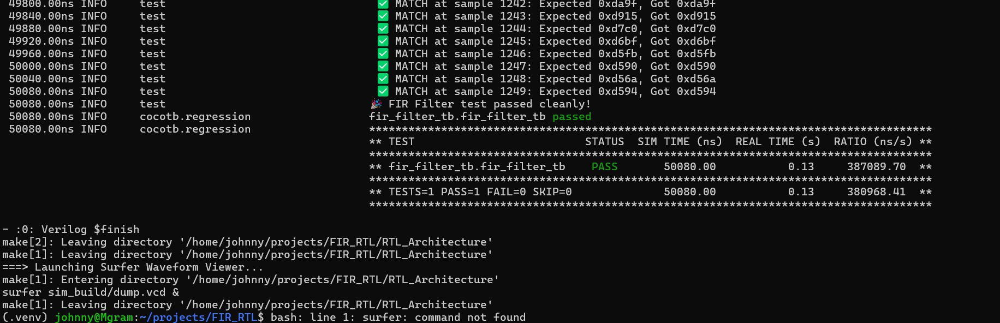

# FIR Filter RTL Implementation

*last updated: 9/11/2026*

---
Welcome to my repo! This project contains my work on building a 47-tap Finite Impulse Response (FIR) filter in SystemVerilog. 


## Intro & Project Background
I chose this project as a self-guided introduction to verilog as a beginner at digital design. I learned a little Verilog in ECE 352 (intro to digital design), and brushed up my Verilog in the early summer of 2026 with HDLbits.com. This project was inspired greatly by ECE 352 and ECE 203 (intro to signal processing). This semester (Fall 2026) I am taking ECE 551, which is more Verilog intensive, and this project was great self-study to prepare myself.  
[FIR filters](https://en.wikipedia.org/wiki/Finite_impulse_response) and [Q-format notation](https://support.arm.com/documentation/dui0066/f/axd/axd-facilities/data-formatting/q-format) are key parts of my project, understanding them both is crucial to understanding my design choices. 

**Note on AI**: AI is not being used for Verilog code generation, and is being used sparingly for python code/housekeeping. As this is one of my first Verilog projects, I would rather push messier, beginner Verilog code that **I wrote** than a streamlined repo of AI content that I don't understand. I hope that a scan through my commit history, comments, and code, will demonstrate the intention I have put into the learning process of this project. 

## Project Status

Currently, the **SystemVerilog RTL** and the **Golden Model (Python)** are fully aligned at the bit-accurate level after successfully resolving rounding biases. 

### What's Done
* **RTL Architecture Design**: 
    * Scaled the architecture from an initial 15-tap parallel filter to a more complex 47-tap FIR filter.
  * Designed and refactored the data path into a pipelined tree structure to optimize timing 
        * see `Notes/` FIRf diagram 1, FIRf diagram 2 (and the diagram below) to see the design evolution.
    * Completed the SystemVerilog implementation (`RTL_Architecture/fir_filter_top.sv`).
    * Design outline below: 

    ```mermaid
    graph TD
    subgraph Pre-Adders ["Stage 1: Input & Pre-adders"]
        
        %% Inh["Coefficient Input: h[23:0]"]
        
        In["Data Input: data_in (Q1.15)"] --> Array["47-Stage Tapped Delay Line <br> x_reg[0] through [46]"]

        Array -->|"x_reg[0] + [46]"| Add0["Pre-Adder 0"]
        Array -->|"x_reg[1] + [45]"| Add1["Pre-Adder 1"]
        Array -->|"..."| AddS["..."]
        Array -->|"x_reg[22] + [24]"| Add22["Pre-Adder 22"]
    end 

    subgraph Multipliers ["Stage 2: Multiply"]
        %% Pre-adders to Multipliers
        Add0 -->|"Q2.15"| M0["Multiplier 0 <br> (Q2.15 * h[0])"]
        Add1 -->|"Q2.15"| M1["Multiplier 1 <br> (Q2.15 * h[1])"]
        AddS -->|"(Q1.15 + Q1.15 = 17'b = Q2.15)"| MS["..."]
        Add22 -->|"Q2.15"| M22["Multiplier 22 <br> x h[22]"]
        Array -->|"x_reg[23] (center)"| M23["Multiplier 23 <br> x h[23]"]
    end

    subgraph Accumulator ["Stage 3: Pipelined Accumulation tree"]

        %% Multipliers to Pipeline Stage 3 (24 -> 12 Registers)
        M0 --> |"Q3.30"| T3_0["Accum_24to12: <br> (M0 + M1)"]
        M1 --> |"Q3.30"| T3_0
        
        MS --> |"(Q2.15 * Q1.15 = Q3.30)"| T3_dots["Accum_24to12: <br> ..."]
        
        M22 --> |"Q3.30"| T3_11["Accum_24to12: <br> (M22 + M23)"]
        M23 --> |"Q3.30"| T3_11

        %% Pipeline Accum_12to6 (12 -> 6 Registers)
            T3_0 --> |"Q4.30"| T4_0["Accum_12to6: <br> Regs (0 + 1)"]
            
            T3_dots --> |"(Q3.30 + Q3.30 = Q4.30)"| T4_dots["Accum_12to6: <br> ..."]
            
            T4_5["Accum_12to6: <br> Regs (10 + 11)"]
            T3_11 --> |"Q4.30"| T4_5

        %% Pipeline Accum_6to3 (6 -> 3 Registers)
            T4_0 --> |"Q5.30"| T5_0["Accum_6to3: <br> Regs (0 + 1)"]
            
            
            T4_dots --> |"(Q4.30 + Q4.30 = Q5.30)"| T5_1["Accum_6to3: <br> Regs (2 + 3)"]
            
            T5_2["Accum_6to3: <br> Regs (4 + 5)"]
            T4_5 --> |"Q5.30"| T5_2

        %% Pipeline Accum_3to2 & Final Accumulator (3 -> 2 -> 1)
            T5_0 --> |"Q6.30"| T6_0["Accum_3to2: <br> Regs (0 + 1)"]
            T5_1 --> |"Q6.30"| T6_0
    
        T6_0 --> |"Q7.30"| T7["Accum_2to1"]
        T5_2 --> |"Q6.30"| T7
    end


    %% Final Output
    T7 --> |"Q8.30"| T8["(bit slice back to Q1.15)"]
    
    subgraph Final output ["Final Output"]
        Out["Filtered Output: data_out"]
    end
        T8 --> |"Q1.15"| Out
    %% Styling
    style Array fill:#1f4e79,stroke:#fff,stroke-width:1px,color:#fff
    style T3_0 fill:#2e75b6,stroke:#fff,stroke-width:1px,color:#fff
    style T3_dots fill:#2e75b6,stroke:#fff,stroke-width:1px,color:#fff
    style T3_11 fill:#2e75b6,stroke:#fff,stroke-width:1px,color:#fff
    style T4_0 fill:#255e91,stroke:#fff,stroke-width:1px,color:#fff
    style T4_dots fill:#255e91,stroke:#fff,stroke-width:1px,color:#fff
    style T4_5 fill:#255e91,stroke:#fff,stroke-width:1px,color:#fff
    style T5_0 fill:#1c476d,stroke:#fff,stroke-width:1px,color:#fff
    style T5_1 fill:#1c476d,stroke:#fff,stroke-width:1px,color:#fff
    style T5_2 fill:#1c476d,stroke:#fff,stroke-width:1px,color:#fff
    style T6_0 fill:#132f48,stroke:#fff,stroke-width:1px,color:#fff
    style T7 fill:#0a1824,stroke:#fff,stroke-width:1px,color:#fff
    style Out fill:#228B22,stroke:#fff,stroke-width:1px,color:#fff
    ```


* **Verification: Golden Model & Hardware Alignment**: 
    * Resolved the 11.5 LSB accumulated truncation delta by matching Python's rounding behavior (.5LSB innaccuracy) with the Verilog RTL's (previously 12LSB).  
        * See the process: [**Finding the bug**](https://github.com/JBrown1214/FIR_Filtering_with_Digital_Design_aGentleIntroduction/commit/fc3f80233fb0e2194166b9dd3f98c768d136b8b1) and [**The results of the fix**](https://github.com/JBrown1214/FIR_Filtering_with_Digital_Design_aGentleIntroduction/commit/ad830034589e2283fc720ae5643af5935ee0f846)
    * Achieved complete bit-accurate consistency between the Python reference model and the hardware implementation, tested with cocotb (`RTL_Architecture/fir_filter_tb.py`):
        * Passing test (`/RTL_Architecture/fir_fitlertb.py`)
        
    

### What I'm Working On Next
* **Synthetic Noise Engine**: 
    * Implement an on-chip Direct Digital Synthesis (DDS) sine wave generator and a Linear Feedback Shift Register (LFSR) noise source to stream data into the FIR filter at 25 MHz.
* **Dual-Buffer BRAM Storage**: 
    * Instantiate a True Dual-Port Gowin Block RAM (BRAM) IP block to store circular buffers of concurrent raw and filtered data waveforms.  

## Repository Structure
* `goldenModel/`: Python reference model, Q1.15 fixed-point conversion scripts, and test vector generation.
* `RTL_Architecture/`: SystemVerilog source files (`.sv`), cocotb testbenches, and the Makefile for simulation.
* `Notes/`: FPGA schematics, handwritten project diagrams
    * `FIRf diagram 1/2`: Architecture plans and visual diagrams (e.g., pipelining strategies).
* `tests/`: `pytest` suite for the Python golden model and Q1.15 math logic.

  
## Tech Stack
*   **Hardware Description**: SystemVerilog (Verilator simulation)
*   **Modeling & Scripting**: Python, NumPy, SciPy
*   **Verification**: [cocotb](https://github.com/cocotb/cocotb), [Verilator](https://github.com/verilator/verilator), pytest
*   **Waveform Viewer**: [Surfer](https://gitlab.com/surfer-project/surfer)

---
*Feel free to poke around the commit history to see how the architecture has evolved. I am actively pushing updates as I continue working*
